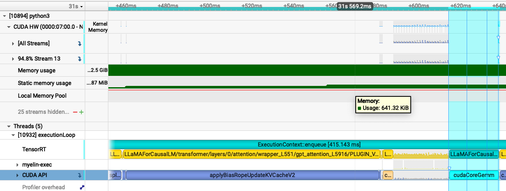
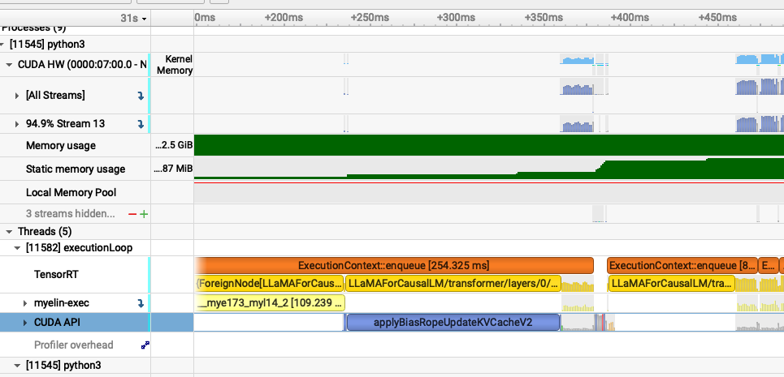
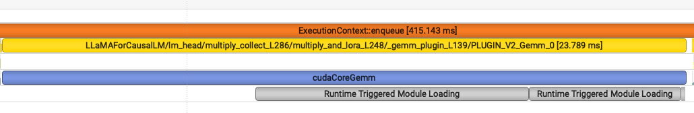
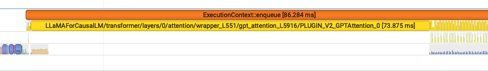

# TensorRT-LLM and Nsight Systems Practice
________________

### Environment details:
* NVIDIA RTX A6000 reserved on Lambda AI
* [Lambda AI 22.04 Base Image](https://docs.lambda.ai/public-cloud/on-demand/#base-images)
* additional env setup in setup.sh and below

```
sudo apt-get update
pip install --upgrade pip setuptools wheel packaging
pip3 install tensorrt_llm
wget https://developer.nvidia.com/downloads/assets/tools/secure/nsight-systems/2025_5/NsightSystems-linux-cli-public-2025.5.1.121-3638078.deb
sudo dpkg -i NsightSystems-linux-cli-public-2025.5.1.121-3638078.deb
pip install cuda-python==12.8 cuda-core
pip install numpy==1.23.0
```
___
### Experiments:
I wanted to see what difference the `--gemm_plugin` option in the trtllm-build API would have, if any, and see if I could observe such changes in the Nsight Systems Application. I used the `auto` and `disable` options with the TinyLlama model.

I used prepare_dataset.py provided in TensorRT-LLM to create a synthetic dataset with an average of 128 input and output tokens and 3000 requests

```
python benchmarks/cpp/prepare_dataset.py --stdout --tokenizer TinyLlama/TinyLlama-1.1B-Chat-v1.0 token-norm-dist --input-mean 128 --output-mean 128 --input-stdev 0 --output-stdev 0 --num-requests 3000 > synthetic_128_128.txt
```
Then I used the `trtllm-build` API to build two different engines with different settings for the `gemm_plugin` option.

```
python ./TensorRT-LLM/examples/models/core/llama/convert_checkpoint.py \
        --model_dir TinyLlama/TinyLlama-1.1B-Chat-v1.0  \ 
        --output_dir ./tllm_checkpoint_1gpu_fp16 \
        --dtype float16

trtllm-build --checkpoint_dir ./tllm_checkpoint_1gpu_fp16 \
            --output_dir ./tiny_llama_fp16_gemm_auto \
            --gemm_plugin auto

trtllm-build --checkpoint_dir ./tllm_checkpoint_1gpu_fp16 \
            --output_dir ./tiny_llama_fp16_gemm_disable \
            --gemm_plugin disable
```

Finally, I used the `trtllm-bench` utility along with the `nsys` CLI tool to gather some traces.

```
nsys profile -o profiling/nsys_trtllm --trace=cuda,nvtx,osrt \
	--cuda-memory-usage=true \
	--sample=none trtllm-bench \
	--model TinyLlama/TinyLlama-1.1B-Chat-v1.0 throughput \
	--dataset synthetic_128_128.txt \
	--engine_dir tiny_llama_fp16_gemm_auto 2>&1

nsys profile -o profiling/nsys_trtllm --trace=cuda,nvtx,osrt \
	--cuda-memory-usage=true \
	--sample=none trtllm-bench \
	--model TinyLlama/TinyLlama-1.1B-Chat-v1.0 throughput \
	--dataset synthetic_128_128.txt \
	--engine_dir tiny_llama_fp16_gemm_disable 
```

___
### Results:

From the standard output of the trtllm-bench tool I saw the following logs  

##### "auto"

```
Request Throughput (req/sec):                     141.2968
Total Output Throughput (tokens/sec):             18085.9891
Total Token Throughput (tokens/sec):              36171.9781
Total Latency (ms):                               21231.9049
Average request latency (ms):                     15698.2533
Per User Output Throughput [w/ ctx] (tps/user):   8.2584
Per GPU Output Throughput (tps/gpu):              18085.9891
```

##### "disabled"

```
Request Throughput (req/sec):                     143.7005
Total Output Throughput (tokens/sec):             18393.6654
Total Token Throughput (tokens/sec):              36787.3308
Total Latency (ms):                               20876.7525
Average request latency (ms):                     15483.5190
Per User Output Throughput [w/ ctx] (tps/user):   8.3822
Per GPU Output Throughput (tps/gpu):              18393.6654
```

Surprisingly, the disabled option seemed to have slightly better performance on all metrics. I'm not sure as to why, if I had more time I would test with varying batch sizes and perhaps a larger LLama model to see if this pattern holds consistent.

I also tried to analyze the data in the Nsight Systems GUI. It was hard to grok anything from the timeline view. For example it was hard to tell if there were less kernels per iteration when the gemm_plugin was set to auto, even after zooming in. However, after the call to "applyBiasRopeUpdateKVCacheV2" I noticed there was a "cudCoreGemm" call in the CUDA API of the auto profile that was absent in the disable profile.






If I zoomed in further on that section I could see that the gemm_plugin was indeed being invoked by TensorRT-LLM in the auto case, whereas in the disabled case GPT attention was used instead.




I was also able to get a useful list of statistics from the CUDA GPU Kernel Summary of the "Stats System View" Tab of the the Nsight GUI. Here are the top 3 most frequent kernels for each of the experiments.

auto:

```
| Time  | Total Time | Instances | Avg        | Name                                                                                                             |
| ----- | ---------- | --------- | ---------- | ---------------------------------------------------------------------------------------------------------------- |
| 41.8% | 7.997 s    | 7,938     | 1.007 ms   | void cutlass::Kernel2\<cutlass\_80\_tensorop\_f16\_s16816gemm\_relu\_f16\_256x128\_32x3\_tn\_align8>(T1::Params) |
| 14.0% | 2.679 s    | 6,028     | 444.412 μs | kernel\_mha                                                                                                      |
| 10.3% | 1.977 s    | 6,146     | 321.672 μs | sm80\_xmma\_gemm\_f16f16\_f16f32\_f32\_tn\_n\_tilesize160x128x32\_stage4\_warpsize2x2x1\_tensor16x8x16\_kernel   |
```

disable:
```
| Time  | Total Time | Instances | Avg        | Name                                                                                                                         |
| ----- | ---------- | --------- | ---------- | ---------------------------------------------------------------------------------------------------------------------------- |
| 33.7% | 6.636 s    | 8,954     | 741.140 μs | sm80\_xmma\_gemm\_f16f16\_f16f32\_f32\_tn\_n\_tilesize192x128x32\_stage4\_warpsize4x2x1\_tensor16x8x16\_execute\_kernel\_trt |
| 26.1% | 5.137 s    | 17,908    | 286.856 μs | sm80\_xmma\_gemm\_f16f16\_f16f32\_f32\_tn\_n\_tilesize160x128x32\_stage4\_warpsize2x2x1\_tensor16x8x16\_execute\_kernel\_trt |
| 13.6% | 2.678 s    | 6,072     | 441.102 μs | kernel\_mha                                                                                                |

```


In the first table, we see the most frequent kernel seems to be a GEMM fused together with relu activation. This is something we would expect as fusing operations together generally is good for througput. However, in the third row we can still see that there are some unfused GEMMs.

From the second table, we can see there are two different unfused GEMMs invoked for two different shapes. Additionally, it seems like they handle fp32 types which is different from dtype of the converted checkpoint.

In summary, from the Nsight tool it seems like the gemm_plugin is doing what it is supposed to be doing even thought it does not seem to yield a performance benefit for this particular model and dataset.